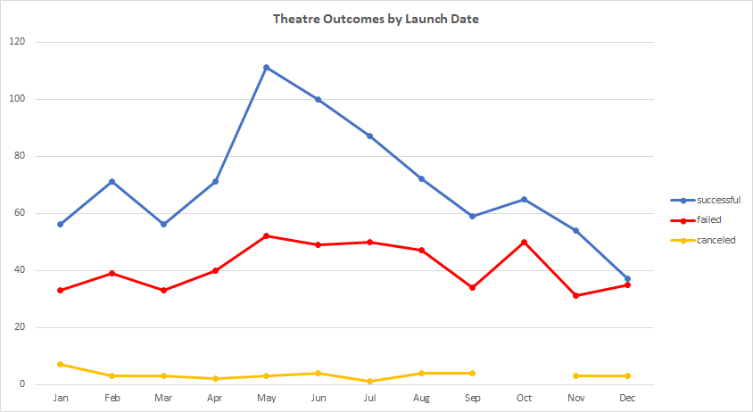
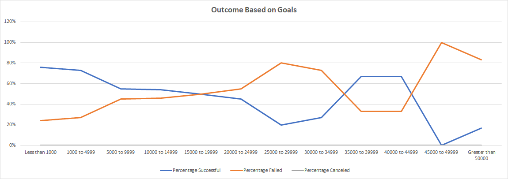

## Kickstarting with Excel

### Project Overview

### Purpose
The following analysis was performed to analyze trends of Successful vs Unsuccessful Kickstarter campaigns for theatre projects in 2009 - 2017. The Kickcstarter campaigns are deemed successful or unsuccessful based on the ability to meet their funding goal before the deadline. 

## Analysis and Challenges

### Analysis of Outcomes Based on Launch Date

The following chart provides a monthly breakdown of successful, failed and canceled Theatre based Kickstarter campaigns.

  

### Analysis of Outcomes Based on Goals

The following chart provides insight on the percentage of successful, failed, and canceled Theatre/Play campaigns based on various goal amounts. 

  

#### Challenges and Difficulties Encountered
I was fortunate enough not to encounter many difficulties or challenges  for this analysis, however additional research was needed for image allignment and resizing.

## Results

1. Based on the analysis of the **Outcomes based on Launch Date** we can determine the following:
   - Approximately 61% of theatre Kickstarter campaigns launched during 2009 - 2017 were successful in achieving their project goal. 
   - Approximately 35% of successful theatre Kickstarter campaigns are launched during the months of May- July. 
  
2. Upon further analysis of **Outcomes based on Goals** for Theatres, we can conclude the following:
   - Approximately 85% of all theatre/play campaigns have a goal limit of under $10000.
   - Approximately 68% of all theatre/play campaigns under the $10000 goal limit were successful in achieving their goal. 

3. Dataset Limitations 
   - The dataset includes samples from all types of Kickstarter campaign types. A larger dataset with only Theatre based Kickstarter campaigns would provide a more detailed and accurate sample for analysis.
   - The goal outcome for successful vs non successful may be skewed based on outliers in the set goal amount.
  
4. Suggestions for other possible tables and/or graphs to provide further insight
   - [Theatre Outcome by Subcategory](https://github.com/joshb738/kickstarter-analysis/blob/main/Resources/Theater_Outcomes_by_Subcategory.png)
  
   
